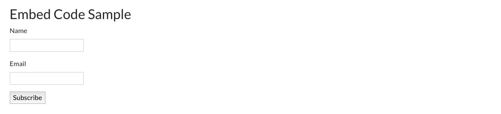
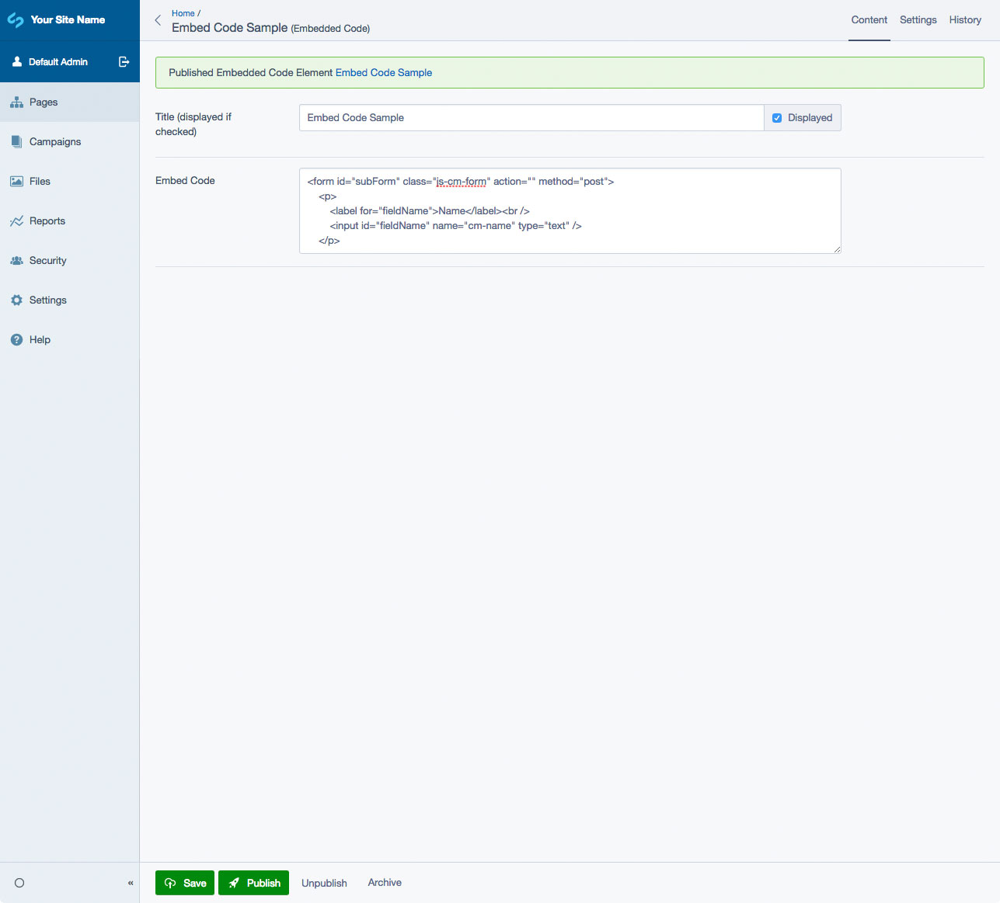

# Silverstripe Elemental Embedded Code

A block to embed code like iFrames or Javascript on a page

[](https://github.com/dynamic/silverstripe-elemental-embedded-code/actions/workflows/ci.yml)
[](https://codecov.io/gh/dynamic/silverstripe-elemental-embedded-code)


[](https://packagist.org/packages/dynamic/silverstripe-elemental-embedded-code)
[](https://packagist.org/packages/dynamic/silverstripe-elemental-embedded-code)
[](https://packagist.org/packages/dynamic/silverstripe-elemental-embedded-code)
[](https://packagist.org/packages/dynamic/silverstripe-elemental-embedded-code)

## Requirements

* silverstripe/recipe-cms: ^5
* dnadesign/silverstripe-elemental: ^5

## Installation

`composer require dynamic/silverstripe-elemental-embedded-code`

## License

See [License](LICENSE.md)

## Example usage

Adds a block to display embeddable code on a page. Useful for iFrames or Javascript embeds, like MailChimp sign up forms.

## Screen Shots

#### Front End sample of an Embed Code Element


#### CMS - Embed Code Element Main Tab



## Getting more elements

See [Elemental modules by Dynamic](https://github.com/orgs/dynamic/repositories?q=elemental&type=all&language=&sort=)

## Configuration

To hide the Content field:

```yml
Dynamic\Elements\Embedded\Elements\ElementEmbeddedCode:
    hide_content_field: true
```

See [SilverStripe Elemental Configuration](https://github.com/silverstripe/silverstripe-elemental#configuration)

## Translations

The translations for this project are managed via [Transifex](https://www.transifex.com/dynamicagency/silverstripe-elemental-baseobject/)
and are updated automatically during the release process. To contribute, please head to the link above and get
translating!

## Maintainers

 *  [Dynamic](https://www.dynamicagency.com) (<dev@dynamicagency.com>)

## Bugtracker
Bugs are tracked in the issues section of this repository. Before submitting an issue please read over
existing issues to ensure yours is unique.

If the issue does look like a new bug:

 - Create a new issue
 - Describe the steps required to reproduce your issue, and the expected outcome. Unit tests, screenshots
 and screencasts can help here.
 - Describe your environment as detailed as possible: SilverStripe version, Browser, PHP version,
 Operating System, any installed SilverStripe modules.

Please report security issues to the module maintainers directly. Please don't file security issues in the bugtracker.

## Development and contribution
If you would like to make contributions to the module please ensure you raise a pull request and discuss with the module maintainers.
